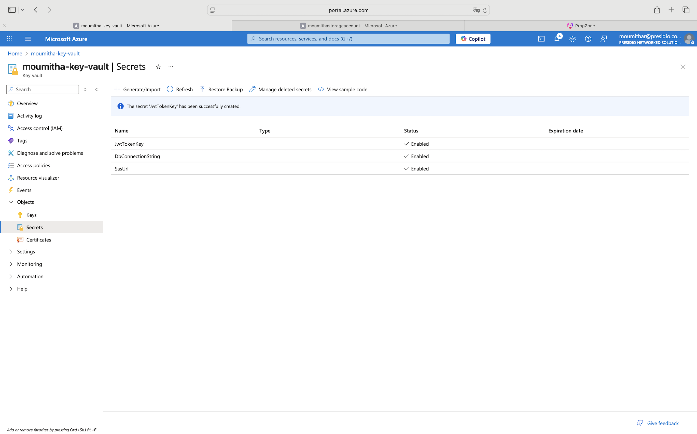

# Day 51

## Description  
Integrated Azure Blob Storage and Azure Key Vault into the PropFinder ASP.NET Core API for secure configuration management.

## Implementation

- Stored SasUrl (for Blob container access).
- Stored DbConnectionString (for PostgreSQL access).
- Kept JwtTokenKey (for authentication token signing).

## Screenshots

### Key Vault

