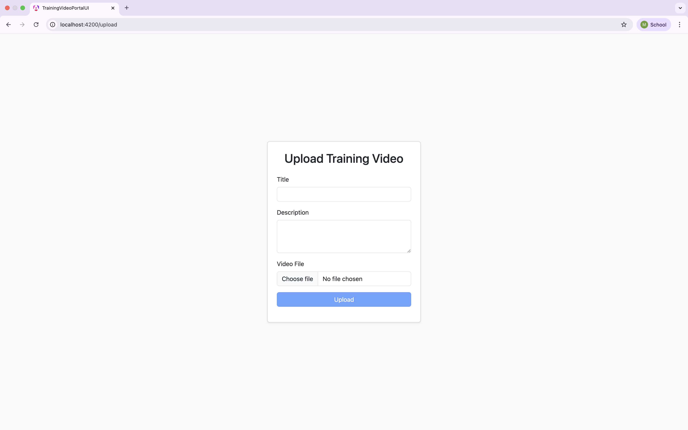
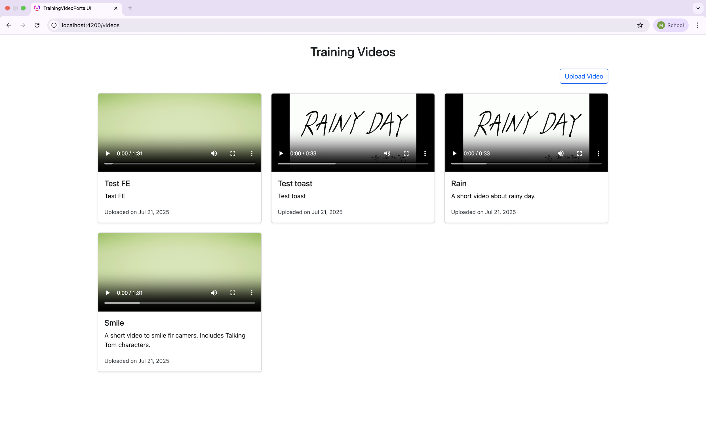

# Day 56

## Description 

### 1.Deployed via Direct Publish to Azure App Service
- Created a Web App in Azure App Service.

- Published the ASP.NET Core project directly from Visual Studio.

- Verified deployment by accessing the /weatherforecast endpoint.

### 2. Deployed via Azure Container Registry (ACR)
- Containerized the API using a custom Dockerfile.

-  Built and pushed the Docker image to Azure Container Registry (moumiacr.azurecr.io/mydockerapiapp:latest).

- Created a new App Service (Container type) and configured it to pull the image from ACR.

- Assigned a User Assigned Managed Identity (UAMI) to the App Service.

- Granted the AcrPull role to the identity for secure image access.

- Verified the container deployment via the public endpoint.

### 3. Training Video Portal 
- Built a .NET 8 Web API to handle video uploads and retrieval from Azure Blob Storage.

- Stored metadata (title, description, blob URL, timestamp) in Azure SQL.

- Configured Blob Storage container (training-videos) using connection string for upload.

- Developed Angular frontend:

    - Upload form with video preview, validation, and success toast.

    - Video list page with embedded `<video>` players showing streamed videos.

    - Routing between /upload and /videos.

## Screenshots

### Direct Publish to App Service

### Deployment Using ACR

### Training Video Portal 

